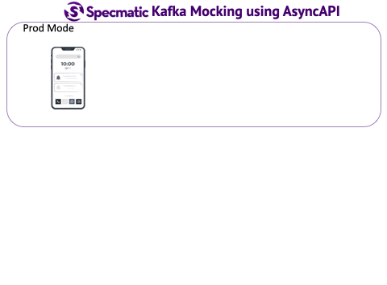

# Specmatic Sample: NodeJS BFF calling Domain API


* [Specmatic Website](https://specmatic.in)
* [Specmatic Documenation](https://specmatic.in/documentation.html)

This sample project demonstrates how we can practice contract-driven development and contract testing in a NodeJS application that depends on an external domain service and Kafka. Here, specmatic is used to stub calls to domain API service based on its OpenAPI spec and mock Kafka based on its AsyncAPI spec.

Here is the [OpenAPI spec](https://github.com/znsio/specmatic-order-contracts/blob/main/in/specmatic/examples/store/API_order_v1.yaml) of the domain API that defines the API endpoints, its request parameters and response along with their schema.

Here is the [AsyncAPI spec](https://github.com/znsio/specmatic-order-contracts/blob/main/in/specmatic/examples/store/API_order_v1.yaml) of Kafka that defines the topics and message schema.

## Definitions
* BFF: Backend for Front End
* Domain API: API managing the domain model
* Specmatic Stub/Mock Server: Create a server that can act as a real service using its OpenAPI or AsyncAPI spec

## Background
A typical web application might look like this. We can use Specmatic to practice contract-driven development and test all the components mentioned below. In this sample project, we look at how to do this for nodejs BFF which is dependent on Domain API Service and Kafka demonstrating both OpenAPI and AsyncAPI support in specmatic.



### Tech
1. NodeJS + Express
2. Specmatic
3. Specmatic Beta extension (for mocking Kafka)
4. Jest & SuperTest

### Start BFF Application
This will start the main nodejs application providing backend service for frontend (BFF)
```shell
DEBUG=specmatic-order-backend-nodejs:* npm start
```
Access find orders API at http://localhost:8080/findAvailableProducts. This is used to demo HTTP stubbing using OpenAPI and Kafka mocking using AsyncAPI<br>
_*Note:* Unless domain API service and Kafka mocks are running, the above requests will fail. Move to the next section for the solution!_

### Start BFF Server with Dependencies (Domain API Stub and Kafka Mock Servers)
This will start the nodejs based BFF server with domain API stubbed using Specmatic HTTP stub server and Kafka mocked using Specmatic Kafka mock server to demonstrate workings of the stub server
```shell
DEBUG=specmatic-order-backend-nodejs:* npm run startWithDeps
```
Access find orders API again at http://localhost:8080/findAvailableProducts with a result like
```json
[{"id":698,"name":"NUBYR","type":"book","inventory":278}]
```

### Run Tests
This will start the Specmatic HTTP stub server for domain API and Specmatic Kafka mock server using the information in specmatic.json and run tests to validate BFF APIs.
```shell
DEBUG=specmatic-order-backend-nodejs:* npm run test-ci
```
